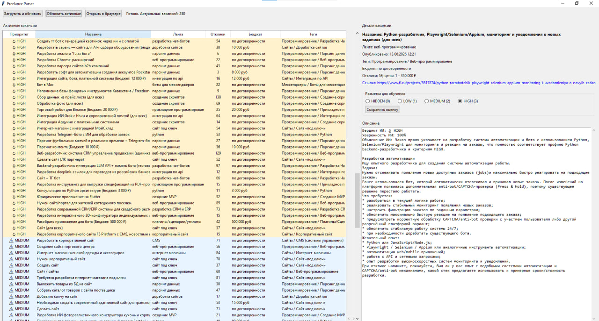

# Freelance Projects Pipeline

**Pipeline для сбора, обработки и AI-анализа проектов с фриланс-биржи**

Сервис получает новые проекты из внешнего источника, загружает детальные страницы, выполняет базовую фильтрацию, отправляет подходящие проекты на AI-анализ и сохраняет уже обработанный результат в базе данных.

`Python` · `asyncio` · `PostgreSQL` · `SQLAlchemy` · `LLM API`

---

## Демонстрация

Ниже показан интерфейс просмотра обработанных проектов: список актуальных заявок, приоритет, данные проекта и результат анализа.

<p align="center">
  
</p>

---

## О проекте

`Freelance Projects Pipeline` — сервис для автоматизации первичного отбора проектов на фриланс-бирже.

Проект решает задачу предварительной обработки ленты проектов: система получает новые заявки, проверяет их на наличие в базе, загружает детальную страницу каждого нового проекта и извлекает данные, необходимые для дальнейшего анализа.

Перед сохранением проект проходит базовую фильтрацию и AI-анализ. Если проект подходит для анализа, его описание отправляется в AI-модуль, который определяет приоритет и формирует объяснение результата.

В базу данных сохраняется уже обработанная сущность: данные проекта, информация со страницы, результат AI-анализа и вычисленный приоритет.

Закрытые или явно неподходящие проекты сохраняются как скрытые, чтобы не обрабатываться повторно и не попадать в активный список.

---

## Основной сценарий работы

Pipeline состоит из двух основных этапов:

1. **Сбор и анализ новых проектов.**
2. **Формирование актуального списка для просмотра.**

На первом этапе система получает проекты из внешнего источника, отбрасывает уже известные, загружает страницы новых проектов, выполняет базовую фильтрацию и AI-анализ, после чего сохраняет уже обработанный результат.

На втором этапе система читает активные проекты из базы, проверяет их актуальность, скрывает закрытые или недоступные проекты, получает динамические данные и возвращает отсортированный список для просмотра.

```text
1. Сбор и анализ новых проектов

Источник проектов
      │
      ▼
Загрузка списка
      │
      ▼
Проверка дублей
      │
      ▼
Загрузка страниц новых проектов
      │
      ▼
Парсинг деталей
      │
      ▼
Базовая фильтрация
      │
      ▼
AI-анализ
      │
      ▼
Сохранение результата в БД


2. Формирование актуального списка

Активные проекты из БД
      │
      ▼
Проверка актуальности
      │
      ▼
Скрытие закрытых / недоступных проектов
      │
      ▼
Получение динамических данных
      │
      ▼
Сортировка по приоритету и дате
      │
      ▼
Список для просмотра в приложении
```

---

## Ключевые сценарии реализации

### Сбор новых проектов

Pipeline проходит по категориям внешнего источника, получает список проектов и приводит данные из ленты к внутреннему формату.

Для каждого проекта проверяется внешний идентификатор. Если проект уже сохранён в базе данных, он пропускается. Если проект новый, он добавляется в список на загрузку детальной страницы.

Такой подход позволяет запускать pipeline регулярно и не создавать дубли.

### Загрузка и парсинг страниц

Для новых проектов загружаются HTML-страницы с детальной информацией.

Из страницы извлекаются данные, которые не доступны в краткой ленте: описание проекта, статус, признаки закрытия и дополнительные поля, необходимые для анализа.

Полученные данные используются до сохранения проекта, поэтому в базу не попадает необработанная лента ради самой ленты.

### Базовая фильтрация

Перед AI-анализом выполняется быстрый предварительный отбор.

Если проект закрыт или явно не подходит по базовым признакам, он не отправляется на AI-анализ и сохраняется как скрытый.

Это снижает количество лишних AI-запросов и оставляет в активной выдаче только потенциально полезные проекты.

### AI-анализ до сохранения

AI-анализ является частью pipeline, а не отдельной постобработкой после сохранения.

Система отправляет на анализ только проекты, которые прошли базовую фильтрацию. AI-модуль оценивает проект, определяет его приоритет и формирует объяснение результата.

После этого проект сохраняется в базе уже вместе с результатом анализа:

- данные из ленты;
- данные детальной страницы;
- приоритет;
- результат AI-анализа;
- флаг видимости.

### Формирование активного списка

После сбора и сохранения новых проектов система формирует актуальный список для просмотра.

Для активных проектов выполняется дополнительная проверка состояния. Если проект был закрыт, недоступен или не удалось получить актуальные данные, он скрывается.

Для валидных проектов загружаются динамические данные, например информация по откликам. После этого проекты сортируются по приоритету и дате публикации.

---

## Устройство приложения

```text
External source
      │
      ▼
Pipeline runner
      │
      ▼
Application services
      ├── загрузка списка проектов
      ├── проверка дублей
      ├── загрузка страниц
      ├── базовая фильтрация
      ├── AI-анализ
      ├── сохранение результата
      └── чтение активных проектов
      │
      ▼
Adapters
      ├── HTTP-клиент
      ├── репозиторий PostgreSQL
      ├── AI-клиент
      └── desktop/view layer
```

**Pipeline runner** запускает процесс обработки и управляет последовательностью этапов.

**Application services** содержат прикладную логику: сбор проектов, фильтрацию, анализ, сохранение и чтение актуального списка.

**Adapters** изолируют технические детали: HTTP-запросы, работу с базой данных и обращение к AI API.

---

## Организация кода

```text
adapters/   внешние адаптеры: HTTP, БД, AI-клиент
core/       конфигурация и логирование
db/         ORM-модели, миграции и маппинг
domain/     доменные сущности, DTO и исключения
infra/      парсинг HTML/XML и технические функции
services/   сценарии обработки pipeline
tasks/      запуск pipeline
tests/      тесты
```

Внешние данные не используются напрямую как доменная модель приложения.

Сначала они приводятся к DTO, после чего передаются в pipeline-сервисы. Это отделяет формат внешнего источника от внутренней логики приложения и упрощает изменение отдельных этапов обработки.

---

## Структура проекта

```text
freelance-pipeline/
├── adapters/
├── core/
├── db/
├── domain/
├── infra/
├── services/
├── tasks/
├── tests/
├── docker-compose.yml
├── Dockerfile
└── README.md
```


---

## Что показывает проект

Проект демонстрирует backend-подход к обработке внешних данных:

- построение pipeline из последовательных этапов;
- работу с внешним источником данных;
- нормализацию данных через DTO;
- предварительную фильтрацию перед AI-запросами;
- AI-анализ до сохранения результата;
- сохранение уже обработанных проектов;
- обновление состояния активных проектов;
- подготовку данных для интерфейса просмотра.